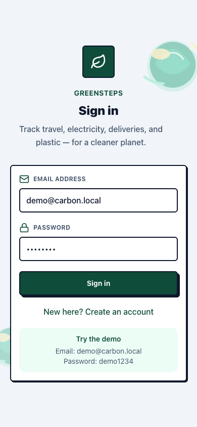
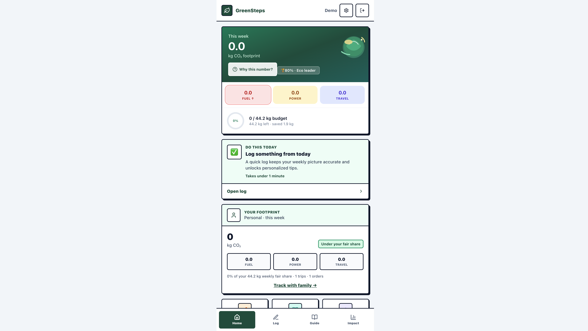
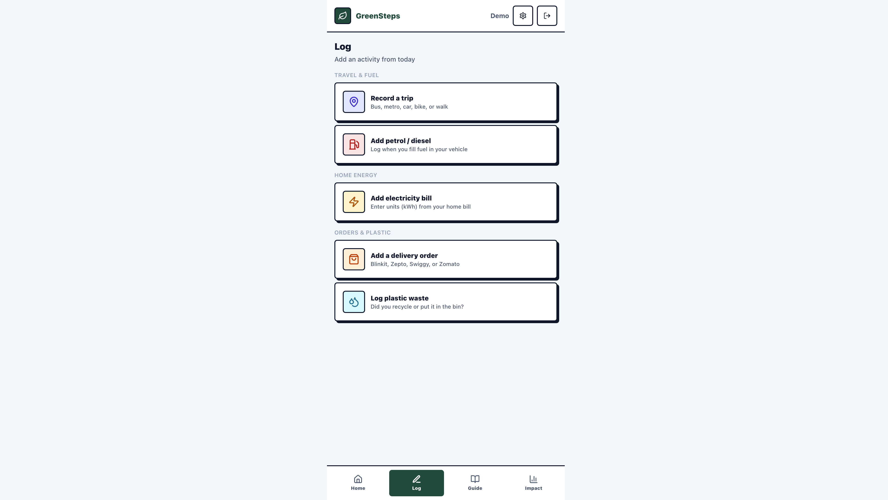
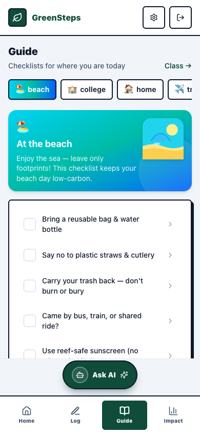
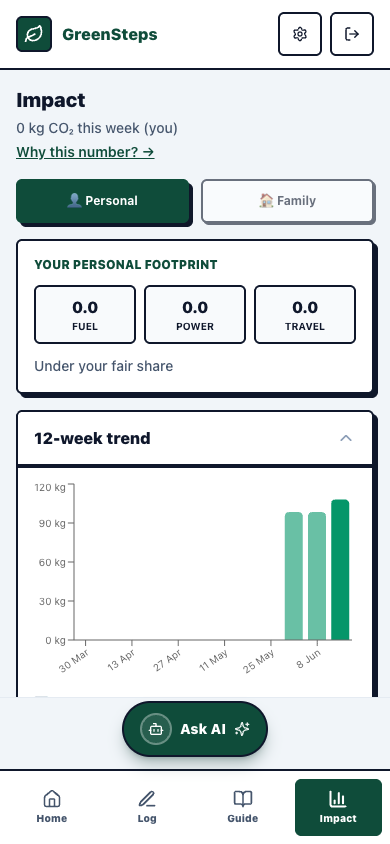
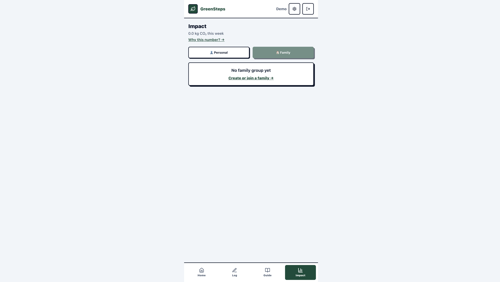
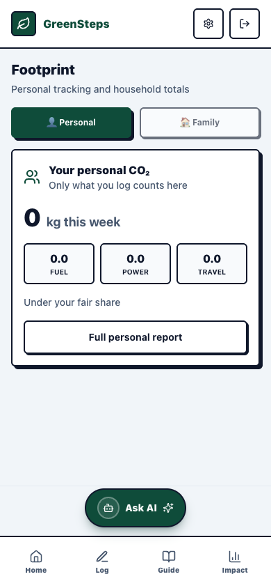
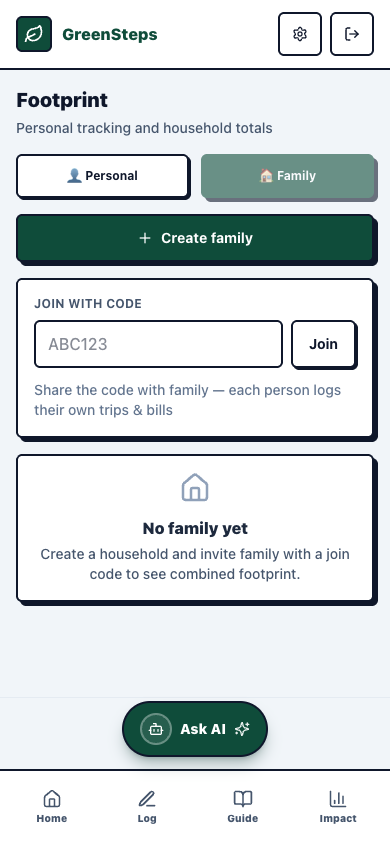
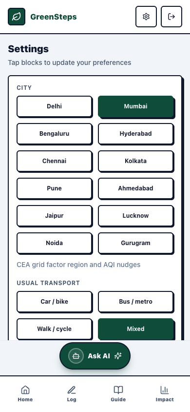

# GreenSteps

[](https://github.com/31pallavisrivastava-ux/greensteps)

**GreenSteps** is a GHG Protocol–aligned personal carbon footprint PWA built for everyday life in India — commute, electricity, quick-commerce deliveries (Blinkit, Zepto, Swiggy, Zomato), plastic waste, and context-aware sustainability checklists.

Emission factors use **CEA Grid V21** (0.7117 kg CO₂/kWh), IPCC fuel factors, and India-specific delivery benchmarks, aligned with [NCMA India GHG Protocol](https://ghg.ncmaindia.org/) guidance.

---

## Challenge submission

| Requirement | Status |
|-------------|--------|
| **Public GitHub repository** | https://github.com/31pallavisrivastava-ux/greensteps ✅ **Public** (verified) |
| **Single branch** | `main` only |
| **Repository size** | ~2.5 MB tracked (under 10 MB limit; `node_modules` not committed) |
| **Complete project code** | Monorepo: `client/`, `server/`, `shared/` |
| **README** | This document |
| **Deployed link** | See [Deploy (free)](#deploy-free) — Render $0 tier |

### Chosen vertical

**Personal Sustainability & Carbon Reduction Assistant**

**Persona:** Urban Indian individuals and families who want to understand and lower their daily carbon footprint from commute, electricity, quick-commerce deliveries, and plastic — without needing expert climate knowledge.

This vertical matches the challenge expectation of a **smart, dynamic assistant** that makes **logical decisions from user context** and delivers **practical, real-world usability**.

> **Note:** The assistant uses a **hybrid coach** — a priority rules engine for “Do this today”, plus an optional **agentic AI coach** at `/coach` powered by **open-source models via Ollama** (Llama, Mistral, etc.), with a rules fallback when Ollama is offline.

### Approach and logic

GreenSteps acts as a **context-aware sustainability coach**, not a static calculator:

1. **Collect** — users log trips (public vs private), fuel, electricity, delivery orders, and plastic; optional bill OCR for kWh.
2. **Compute** — an emissions engine maps activity to GHG Protocol scopes using India-specific factors (CEA grid, IPCC fuel, merchant packaging defaults).
3. **Decide** — a priority-based rules engine picks one **“Do this today”** action; the **agentic coach** (`/coach`) can answer free-form questions using the same live data via tool calls.
4. **Nudge** — context checklists (beach, school, home), AQI-based transport tips, weekly challenges, and fair-share budget ring keep behaviour change actionable.
5. **Socialise** — family household totals, class leaderboard, and shareable milestone cards.

**Decision priority (highest first):**

```
Unconfirmed trips → Missing power data when electricity is top driver
→ High delivery volume → Low public transport for car users
→ Plastic landfill > recycled → High electricity share → Default daily log
```

The assistant also adapts to onboarding choices: **city** (grid + AQI), **transport preference**, and **top concern** (power, commute, delivery, plastic).

### How the solution works

```
User logs activity (PWA)
        ↓
Express API + Prisma (SQLite)
        ↓
Emissions engine → weekly CO₂ by scope
        ↓
┌───────────────────────────────────────┐
│ Dynamic assistant layer               │
│ • resolveTodayAction() — daily nudge  │
│ • Agentic coach — Ollama + 5 tools  │
│ • Guide contexts — situational lists  │
│ • AQI + city — local air tips         │
│ • Challenges & budget — gamification  │
│ • Family dashboard — household rollup │
└───────────────────────────────────────┘
        ↓
React UI — Home / Log / Guide / Impact + global **Ask AI** footer
```

**Key flows:**

- **Home:** weekly summary + personalized “Do this today” card + personal footprint
- **Log:** single hub for all activity types
- **Guide:** pick context → interactive checklist → save progress
- **Impact:** personal vs family toggle, 12-week trend, explain drill-down
- **Family:** create/join household with code → per-member + combined CO₂
- **Ask AI:** floating pill above the bottom nav on every screen → agentic coach chat at `/coach`

Run locally:

```bash
git clone https://github.com/31pallavisrivastava-ux/greensteps.git
cd greensteps && npm install && cp server/.env.example server/.env
npm run db:push && npm run db:seed && npm run dev
```

Demo: `demo@carbon.local` / `demo1234` → http://localhost:5173

Run tests: `npm test` (unit + API integration; uses isolated `test-integration.db`)

| Test suite | What it validates |
|------------|-------------------|
| `todayAction.test.js` | Assistant decision priority rules |
| `utilityBillParser.test.js` | Indian electricity bill OCR parsing |
| `emissionsBudget.test.js` | Science-based weekly fair-share constant |
| `api.integration.test.js` | Health, auth, `/insights/personal`, family create/join, coach chat/status |

### Assumptions

- **Target users** are English-speaking urban Indians with smartphone access.
- **Manual + semi-automatic logging** is acceptable for MVP (GPS trip drafts, manual confirm; bill OCR optional).
- **SQLite** is sufficient for demo/evaluation; production would use a managed database.
- **Emission factors** are static JSON seeded from CEA/IPCC benchmarks, not live API feeds.
- **Family energy** may double-count if multiple members log the same bill — UI warns users to assign one bill logger per household.
- **AQI** uses Open-Meteo from the user’s selected city; no street-level precision.
- **Class leaderboard** compares CO₂ *saved*, not absolute footprint, to reward improvement.
- **Authentication** is email/password with JWT; no OAuth in MVP.
- **No real payment or merchant API integration** — delivery orders are user-declared.

### Evaluation alignment

| Tier | Area | How GreenSteps addresses it |
|------|------|----------------------------|
| **High** | Smart dynamic assistant | Priority rules engine, agentic Ollama coach with tool calls, context checklists, AQI nudges |
| **High** | Context-based decisions | Onboarding profile + weekly footprint drive daily action |
| **High** | Real-world usability | India merchants, CEA grid, mobile PWA, demo account |
| **High** | Code quality | Monorepo, shared types, modular engines, consistent UI patterns |
| **Medium** | Security | JWT auth, bcrypt passwords, Zod validation, `.env` for secrets |
| **Medium** | Efficiency | SQLite for dev, aggregated queries, optional endpoints don’t block UI |
| **Medium** | Testing | `npm test` — 15 tests: assistant rules, OCR, budget constant, API auth/personal/family/coach |
| **Medium** | Accessibility | Skip links, focus rings, dialog trap, 44px targets, page titles |
| **Low** | Polish | Block UI, screenshots, WhatsApp share cards, 12-week charts |

---

## Table of contents

- [Challenge submission](#challenge-submission)
- [Screenshots](#screenshots)
- [Stack](#stack)
- [Quick start](#quick-start)
- [Deploy (free)](#deploy-free)
- [App navigation](#app-navigation)
- [Features](#features)
- [Family tracking](#family-tracking)
- [API overview](#api-overview)
- [Project structure](#project-structure)
- [Scripts](#scripts)
- [Configuration](#configuration)
- [Troubleshooting](#troubleshooting)
- [Differentiation](#differentiation)
- [License](#license)

## Screenshots

| Sign in | Home |
|---------|------|
|  |  |

| Log hub | Guide checklists |
|---------|------------------|
|  |  |

| Impact (personal) | Impact (family) |
|-------------------|-----------------|
|  |  |

| Personal footprint | Family household |
|--------------------|------------------|
|  |  |

| Settings |
|----------|
|  |

## Stack

| Layer | Tech |
|-------|------|
| **Client** | React 19, Vite, Tailwind CSS 4, Recharts, Tesseract.js (bill OCR), PWA (Workbox) |
| **Server** | Express 5, Prisma, SQLite (dev) |
| **Shared** | TypeScript types, enums, merchant packaging defaults, Indian city list |

Monorepo workspaces: `client/`, `server/`, `shared/`.

## Quick start

```bash
git clone https://github.com/31pallavisrivastava-ux/greensteps.git
cd greensteps
npm install
cp server/.env.example server/.env
npm run db:push
npm run db:seed
npm run dev
```

| Service | URL |
|---------|-----|
| App | http://localhost:5173 |
| API | http://localhost:3001 |
| Health | http://localhost:3001/api/health |

**Demo login:** `demo@carbon.local` / `demo1234`

## Deploy (free)

**Cost: $0/month** using [Render](https://render.com) free tier — one URL serves both the PWA and API (no separate frontend host needed).

| Platform | Cost | Best for |
|----------|------|----------|
| **Render** (recommended) | Free | Easiest — connect GitHub, auto-deploy from `render.yaml` |
| Vercel + Render | Free | Split frontend/backend (more setup) |
| Fly.io | Free allowance | Persistent SQLite volume (advanced) |
| Railway | ~$5/mo hobby | Always-on, no cold starts |

### Render — step by step (~10 min)

1. Push this repo to GitHub (already at [greensteps](https://github.com/31pallavisrivastava-ux/greensteps)).
2. Go to [render.com](https://render.com) → sign up with GitHub.
3. **New → Blueprint** → select the `greensteps` repo → Apply.
4. Wait for the build (~3–5 min). You get a URL like `https://greensteps.onrender.com`.
5. Paste that URL in your challenge submission as the **Deployed Link**.
6. Test: open the URL → sign in with `demo@carbon.local` / `demo1234`.

**What to expect on free tier:**

- **Cold starts** — first visit after ~15 min idle may take 30–60 s to wake up.
- **SQLite** — demo data is re-seeded on each deploy; fine for judges/reviewers.
- **Ask AI coach** — uses the **rules fallback** in the cloud (Ollama is local-only on your Mac). Full agentic coach still works when you run locally with Ollama.

**Optional env vars** (Render dashboard → Environment):

```env
NODE_ENV=production
DATABASE_URL=file:./dev.db
JWT_SECRET=<auto-generated>
LLM_AGENT_ENABLED=false
```

### Manual deploy (any Node host)

```bash
npm install
npm run build
npm run db:generate -w server && npm run db:push -w server && npm run db:seed -w server
NODE_ENV=production PORT=3001 npm start
```

Open `http://localhost:3001` — the server serves the built PWA and `/api` on the same port.

Verify the API is on the latest build:

```bash
curl http://localhost:3001/api/health
# → { "status": "ok", "routes": ["insights/personal", "insights/history", "family", "coach"], ... }
```

## App navigation

Four bottom tabs keep the UI focused. A global **Ask AI** pill sits in a fixed footer row above the tabs on every authenticated screen (hidden on `/coach` while you chat).

| Tab | Purpose |
|-----|---------|
| **Home** | Weekly hero, personal footprint card, “Do this today”, budget ring, challenges |
| **Log** | Add trips, fuel, electricity, deliveries, or plastic |
| **Guide** | Context checklists (beach, school, home, travel, market) + tips |
| **Impact** | Personal vs family toggle, 12-week trend, breakdown, challenges, share |

| Footer / route | Purpose |
|----------------|---------|
| **Ask AI** (all screens) | One tap to open the agentic coach — uses live footprint data via tool calls |
| `/coach` | Full-screen chat with Ollama (or rules fallback when offline) |

Additional routes:

| Route | Purpose |
|-------|---------|
| `/family` | Personal vs household footprint; create/join family groups |
| `/settings` | City, transport preference, top concern |
| `/onboarding` | First-run setup (city → transport → concern) |
| `/class` | School leaderboard (create/join with code) |
| `/trips`, `/fuel`, `/energy`, … | Reachable from Log |

## Features

### Agentic AI coach (`/coach`) — open-source via Ollama

The coach is always one tap away: an **Ask AI** pill in the fixed footer appears on Home, Log, Guide, Impact, Settings, Family, and all other main app screens. It opens `/coach`, where you can ask free-form questions about your footprint.

| Mode | When | Behavior |
|------|------|----------|
| **Agent** | Ollama running + model pulled | Local OSS model runs a tool-calling loop (up to 5 steps) against live footprint APIs |
| **Rules** | Ollama offline (demo default) | Keyword router + same tools — still uses real user data |

**Setup (one-time):**

```bash
# Install from https://ollama.com then:
ollama pull llama3.1:8b    # or mistral, phi3, llama3.2
ollama serve               # usually auto-starts on macOS
```

**Recommended open models** (all free, local, private):

| Model | Pull command | Notes |
|-------|--------------|-------|
| Llama 3.1 8B | `ollama pull llama3.1:8b` | Default — good tool use |
| Mistral 7B | `ollama pull mistral` | Fast, lightweight |
| Phi-3 | `ollama pull phi3` | Small, runs on low RAM |
| Llama 3.2 3B | `ollama pull llama3.2:3b` | Smallest viable option |

Set in `server/.env`:

```env
LLM_BASE_URL="http://127.0.0.1:11434"
LLM_MODEL="llama3.1:8b"
```

**Tools the agent can call:**

- `get_personal_footprint` — weekly CO₂ split and fair-share status  
- `explain_footprint` — line-by-line breakdown with formulas  
- `get_weekly_trend` — 12-week history and direction  
- `get_today_action` — prioritized daily nudge  
- `get_engagement_summary` — budget, challenges, streaks, AQI  

Example questions: *“Why is my footprint high?”*, *“What should I do today?”*, *“Am I on track for my budget?”*

### Personal & family footprint

- **Personal footprint** — your weekly CO₂ split by fuel, power, and travel with fair-share status
- **Family groups** — create a household, share a join code, see combined totals and per-member breakdown
- **Impact toggle** — switch between personal charts and household view on the Impact tab
- **12-week trend** — bar chart with week-over-week direction
- **Why this number?** — drill-down modal explaining how your total was calculated

Each family member logs their own trips and bills. Avoid double-counting shared electricity by having one person log the household bill.

### Footprint tracking (GHG scopes)

| Area | Scope | What you log |
|------|-------|--------------|
| Trips | 3 | GPS + mode confirmation (bus, metro, car, walk, cycle…) |
| Fuel | 1 | Petrol / diesel / CNG fill-ups |
| Energy | 1+2 | kWh, LPG, optional solar offset; bill OCR (Tesseract) |
| Deliveries | 3 | Blinkit, Zepto, Swiggy Instamart, Swiggy Food, Zomato |
| Plastic | 3 | Purchase-linked + household disposal / recycling |

### Onboarding & personalization

- **3-step onboarding** — city, usual transport, top concern
- **Settings** — block-style city picker (12 Indian cities), transport preference, concern
- **Do this today** — one personalized daily action based on your profile and recent logs
- **AQI nudges** — local air quality (Open-Meteo) with transport tips

### Engagement & motivation

- **Weekly challenges** — e.g. 3 delivery-free days, 5 bus/metro trips, school/beach checklist
- **Streaks** — delivery-free, public transport, walk/cycle
- **Science-based budget** — ~44 kg/week fair share (~2.3 t/person/year IPCC equity path) with progress ring
- **Community comparison** — percentile rank vs benchmark users
- **Class leaderboard** — create/join with a code; ranked by CO₂ saved
- **Share milestones** — text share + WhatsApp-ready PNG image cards
- **Rewards** — celebrations, badges, weekly wins after logging

### Context checklists (Guide)

Interactive checklists for where you are today:

- 🏖️ **Beach** — reusable bottle, carry trash, public transport, reef-safe sunscreen
- 🏫 **School** — tiffin box, bus/metro, lights off, recycle
- 🏠 **Home** — AC at 26°C, segregate waste, skip extra deliveries
- ✈️ **Travel** — train over taxi, refill bottle
- 🛒 **Market** — cloth bag, local produce, bulk packs

### UI & accessibility

- **Block-style UI** — neo-brutalist cards with thick borders and offset shadows
- **Global Ask AI footer** — centered pill above the bottom nav on every main screen; aligned with the app column and safe-area aware
- **Keyboard & screen reader** — skip links, focus rings, dialog trap, `role="alert"` for errors
- **Touch targets** — 44px minimum on primary actions

## Family tracking

1. Open **Home** → tap **Track with family →**, or go to `/family`.
2. Tap **Create family**, name your household, and copy the join code.
3. Share the code — each member signs up or logs in on their device and taps **Join**.
4. Everyone logs their own trips, fuel, energy, and orders.
5. View combined totals on **Impact → Family** or the full breakdown on `/family`.

**API flow:**

```
POST /api/family              { "name": "Sharma household" }
POST /api/family/join         { "joinCode": "ABC123" }
GET  /api/family              → list your households
GET  /api/family/:id/dashboard → household + per-member weekly CO₂
GET  /api/insights/personal   → your individual weekly CO₂
```

## API overview

```
GET  /api/health
POST /api/auth/login | /register
GET  /api/users/me
PATCH /api/users/me              # city, onboarding, preferences

GET  /api/trips
POST /api/trips/draft | /:id/confirm
POST /api/fuel | /api/energy | /api/purchases/orders | /api/plastic

GET  /api/insights/weekly
GET  /api/insights/personal      # personal footprint summary
GET  /api/insights/history       # ?weeks=12
GET  /api/insights/explain       # footprint drill-down

GET  /api/family                 # list households
POST /api/family                 # create household
POST /api/family/join            # join with code
GET  /api/family/:id/dashboard   # household + member totals

GET  /api/engage/dashboard       # challenges, streaks, budget, AQI
GET  /api/engage/today-action    # personalized daily nudge

POST /api/coach/chat             # Ollama agentic coach (OSS model + tools)
GET  /api/coach/status           # Ollama reachability + model check

GET  /api/guide/contexts | /comparison | /milestones/share
POST /api/energy/ocr             # Indian bill scan (kWh extraction)

POST /api/groups                 # create class
POST /api/groups/join
GET  /api/groups/:id/leaderboard
```

## Project structure

```
carbon-footprint-pwa/
├── client/                 # React PWA
│   ├── src/pages/          # Home, Log, Guide, Impact, Family, Coach, Settings, …
│   ├── src/components/     # UI, CoachFab, engage, PersonalFootprintCard, CityPicker
│   └── src/lib/            # API, auth, share cards
├── server/
│   ├── src/modules/        # emissions, rewards, guide, engage, family, insights, coach
│   ├── src/routes/         # Express routers (incl. coach)
│   ├── data/               # factors, checklists, challenges, cities
│   └── prisma/             # schema + seed
├── shared/                 # @carbon/shared types & enums
└── docs/screenshots/       # README screenshots
```

## Scripts

```bash
npm run dev          # client :5173 + server :3001
npm run build        # shared → server → client
npm run test         # 15 tests: assistant rules, bill OCR, budget, API + coach
npm run db:push      # apply Prisma schema (required after model changes)
npm run db:seed      # emission factors, merchants, demo user
```

## Configuration

`server/.env`:

```env
DATABASE_URL="file:./dev.db"
JWT_SECRET="change-me-in-production"
PORT=3001

# Open-source local LLM (Ollama) — see Agentic AI coach section
LLM_BASE_URL="http://127.0.0.1:11434"
LLM_MODEL="llama3.1:8b"
LLM_PROVIDER="ollama"
```

Set your city via Settings or `PATCH /api/users/me` with `{ "city": "Mumbai" }` for AQI.

Supported cities: Delhi, Mumbai, Bengaluru, Hyderabad, Chennai, Kolkata, Pune, Ahmedabad, Jaipur, Lucknow, Noida, Gurugram.

## Troubleshooting

| Problem | Fix |
|---------|-----|
| `404` on `/api/family`, `/api/insights/personal`, or `/api/insights/history` | Old API still on port 3001. Run `lsof -i :3001`, kill the PID, then `npm run dev`. |
| Health check missing `family` or `coach` in routes | Same as above — restart the server after `git pull`. |
| Home loads but personal/family cards empty | Optional endpoints failed; core app still works. Restart API and hard-refresh (Cmd+Shift+R). |
| PWA shows stale errors | DevTools → Application → Service Workers → Unregister, then reload. |
| Schema errors after pull | Run `npm run db:push` then `npm run db:seed`. |
| Coach always offline / rules-only replies | Install [Ollama](https://ollama.com), run `ollama pull llama3.1:8b`, restart server. Check `GET /api/coach/status`. |
| **Ask AI** button overlaps content | Hard-refresh after pull — footer stacks FAB above nav with extra scroll padding. |

## Differentiation

Compared to generic carbon calculators and offset-first apps:

- **India-native** — quick-commerce merchants, CEA grid, urban commute patterns
- **Personal + household** — track your own footprint and combine with family
- **Reduce first** — budget, challenges, and checklists before offsets
- **Context-aware** — beach / school / home nudges, not one static survey
- **Plastic + delivery together** — upstream orders and downstream disposal
- **Open-source AI coach** — global **Ask AI** entry on every screen; Ollama agent with live data tools, rules fallback offline
- **Social** — class leaderboard + shareable image milestones

## License

Private / local development. Adjust licensing as needed for your deployment.
